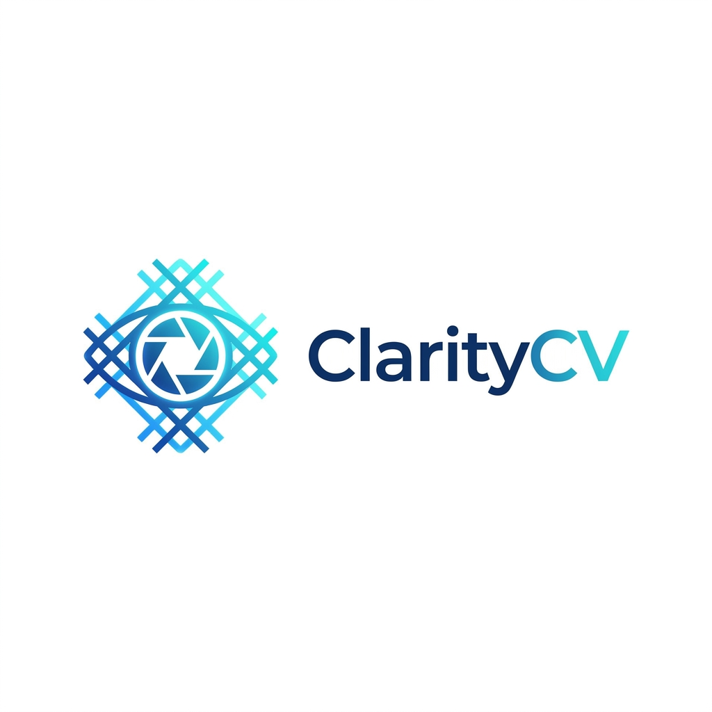

# ClarityCV — Advanced Interactive Computer Vision Pipeline



ClarityCV is a modern, real-time computer vision workspace that bridges the gap between raw algorithmic power and intuitive design. Whether you are performing surgical image filtering, balancing contrast with histogram equalization, pinpointing geometry with Harris Corner detection, or executing precise pixel segmentation—ClarityCV makes deterministic, high-performance digital image processing accessible and visually stunning.

[](#)
[](#)
[](#)

## Demo


<p>To see ClarityCV's processing engine in action, <a href="[INSERT_DRIVE_LINK_HERE]">click here for the full video demonstration</a>.</p>

## Screenshot Gallery

### Core Interface

These screenshots showcase the main ClarityCV workspace, designed for maximum visibility and effortless control:


---

### Media & Feature Visualization

ClarityCV includes an array of real-time viewers for deep visual analysis and transformation:

- 
- 
- 
- 

---

### 🎚️ Algorithms & Controls

Screens demonstrating our frictionless user interaction and workflow:

- **Algorithm Selector (Filter / Equalize / Segment / Detect)** — Users can seamlessly switch between mathematical models optimized for different visual tasks.
- **Histogram Equalization Enabled** — The pipeline automatically recalculates and balances pixel distributions for optimal image contrast.
- **Custom Filter Controls (Add / Remove Kernels)** — Users can build a custom processing pipeline by tweaking individual convolution matrices.
  - **Filter Configuration Window** — 
- **Live Harris Corner Detection** — Displays interactive, real-time overlays mapping key structural corners. Can be **shown or hidden** instantly depending on user preference.
- **Project Export / Reset** — Export your visual pipeline configurations or reset the workspace with a single click.

---

---

## Quick Pitch — Meet ClarityCV

**ClarityCV** is an interactive, browser-based computer vision laboratory built for both **enterprise research** and **algorithmic education**.  
It combines precise manual image processing tools with high-speed digital signal processing—giving you a comprehensive environment to analyze, transform, and understand visual data without relying on black-box AI models.

### It includes:

- **Precision Segmentation & Feature Extraction** Send images to a configurable backend and instantly receive _processed media_, _thresholded masks_, and _structural features_ (like Harris corners) tailored for your specific engineering use case.

- **Per-Task Media Pipelines** Maintain distinct processing layers for filtering, contrast enhancement, or object isolation—each operation features its own isolated visual data flow.

- **Real-Time Visual Analytics** Side-by-side media comparisons, spatial transformations, and a **linear vs. logarithmic histogram** toggle for deep-dive pixel analysis and professional grading.

- **Lightweight Project Sharing** A clean, standardized JSON project format that saves your convolution kernels, sensitivity thresholds, and pipeline presets for seamless team collaboration and reproducibility.

---

## Use Cases

- **Computer Vision Engineers & Robotics** Extract critical geometric features using Harris corner detection, map environment boundaries, and pre-process visual feeds for navigation algorithms.

- **Medical Imaging & Security Analysts** Apply advanced histogram equalization to low-contrast X-rays or security footage, enhancing edges and highlighting critical anomalies for human review.

- **Students & Researchers in DIP (Digital Image Processing)** Visualize convolution kernels, explore thresholding techniques, interpret histograms, and master real-time algorithmic computer vision concepts in an interactive playground.

---

**Table of contents**

- [Installation](#installation)
- [Quick Start](#run)
- [Usage](#usage)
- [Project JSON Format](#project-json-format)
- [Vision Endpoints](#vision-endpoints)
- [Development & Contributing](#development--contributing)

---

# Installation

Prerequisites

- Node.js (for the client frontend dev server)
- Python 3.10+ with a virtual environment for the backend
- A C++17 compiler (for compiling the native, high-speed matrix engine)

Install backend dependencies (from `Server` folder):

```powershell
cd "ClarityCV\Server"
python -m venv .venv
& .venv\Scripts\Activate.ps1
pip install -r requirements.txt
```
